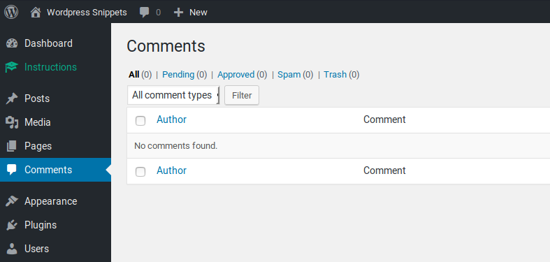
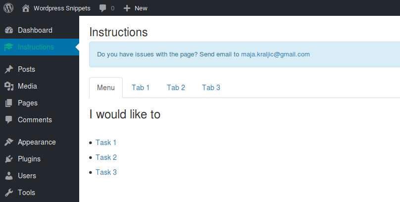

# WP Instructions

Tags: instructions, manual, help, page, tabs
Version: 1.0

A helpful tab for web admins who need instructions. Accessible from the main menu.

## Screenshots

### Icon in the main navigation

### WP Instructions default tab

## Features
- It creates a single admin page with a couple of tabs.
- All data can be edited in the main file `page.php`.
- It uses Bootstrap for content building.

## Installation instructions
* Copy `wp-instructions` directory in `/wp-content/plugins/`
* Activate plugin on Installed plugin page in Wordpress admin.
* Customize the content in `page.php`.
